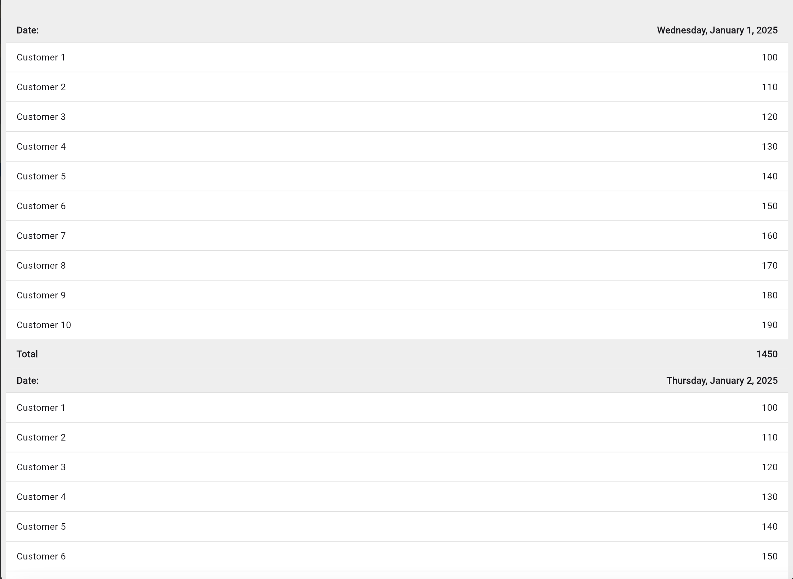
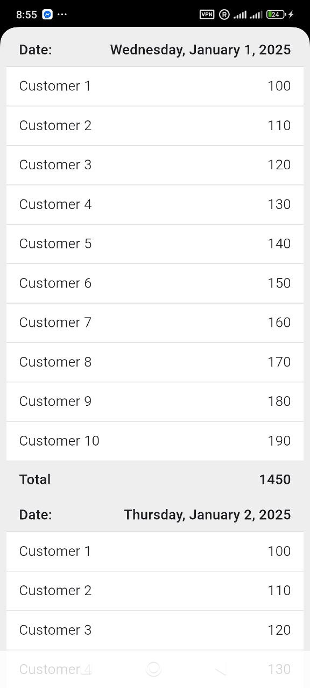

# Flutter: Архитектурный пример высокопроизводительного списка

Это демонстрационный проект на Flutter, который показывает, как создать пользовательский интерфейс для отображения очень больших объемов сгруппированных данных (вплоть до 365 дней * 1000 клиентов) без замораживания или замедления интерфейса.

## Проект разработан как универсальное решение, которое эффективно работает как на мобильных платформах (iOS, Android), так и в веб-браузерах.

# Ключевые особенности и технические моменты
Эффективная обработка больших данных: Приложение способно обрабатывать и отображать сотни тысяч записей, сгруппированных по дням.
Отзывчивый пользовательский интерфейс: UI остается плавным и отзывчивым (60 FPS) даже во время интенсивной обработки данных.
Асинхронная обработка данных: Вся ресурсоемкая работа по группировке и сортировке данных выполняется без блокировки основного потока (UI thread).
Универсальное решение (Cross-Platform): Используемый подход одинаково хорошо работает на мобильных платформах и в вебе, несмотря на их архитектурные различия (например, отсутствие Isolate в вебе).
Комплексное тестирование: Проект включает в себя полный набор тестов:
Unit-тесты для проверки бизнес-логики.
Widget-тесты с использованием моков для проверки UI в изоляции.
Integration-тесты для проверки всего приложения в реальных условиях.
Единый файл (main.dart): Весь код приложения намеренно размещен в одном файле в соответствии с поставленной задачей.
## Архитектурный подход
Для решения проблемы производительности при работе с большими списками были применены две ключевые стратегии.

1. Рендеринг: "Ленивая загрузка" с помощью ListView.builder
   Наивная реализация списка с помощью Column внутри SingleChildScrollView привела бы к попытке отрисовать все 365 карточек одновременно. Это вызвало бы огромное потребление памяти и замораживание приложения.

   Решение: ListView.builder — это стандартный и самый эффективный способ создания списков в Flutter. Он работает по принципу "ленивой загрузки":

   Создает элементы по требованию: Виджет для элемента списка создается только в тот момент, когда он должен появиться на экране.
   Переиспользует ресурсы: Когда элемент прокручивается и уходит с экрана, его ресурсы могут быть использованы для создания нового элемента.
   Это гарантирует низкое потребление памяти и высокую производительность независимо от общего количества элементов в списке.

2. Обработка данных: "Асинхронная обработка порциями" (Asynchronous Chunking)
   Обработка 365 дней данных — это долгая, синхронная операция, которая заблокировала бы UI-поток, вызвав полное "зависание" приложения на несколько секунд.

## Решение:
Мы разбиваем одну большую задачу на множество маленьких и выполняем их поочередно, давая UI-потоку возможность "вздохнуть" между ними.

Это достигается с помощью цикла, в котором после обработки одной порции данных (одного дня) вызывается await Future.delayed(Duration.zero);. 
Этот вызов не создает реальной задержки, а передает управление циклу событий Flutter. Это позволяет системе обработать пользовательский ввод,
отрисовать кадры анимации и сохранить отзывчивость интерфейса. В результате пользователь видит, как список заполняется постепенно,
но само приложение никогда не зависает.

## Скриншоты

